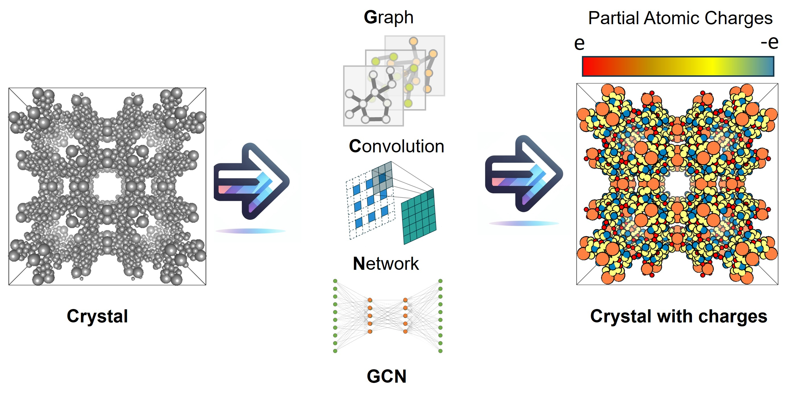
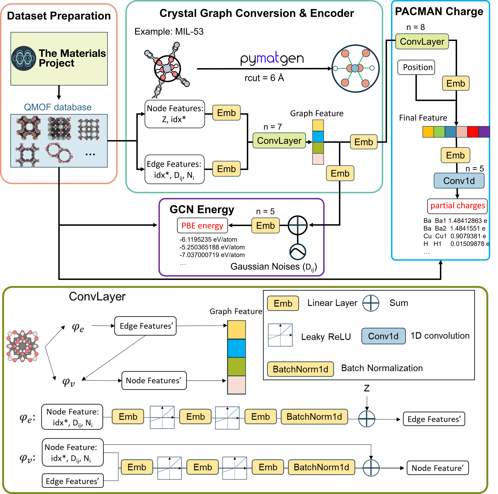

<h1 align="center">GCN Charge</h1>

<h4 align="center">

</h4>              

A MOF/COF charge predicter by **G**raph **C**onvolution **N**etwork.                           

[](https://python.org/downloads) [](https://doi.org/10.5281/zenodo.10822403)  [](https://github.com/sxm13/GCNCharges/LICENSE.txt) [](mailto:sxmzhaogb@gmail.com) []() []()          
                      

# Download

```sh
git clone https://github.com/sxm13/GCNCharges.git
```   

# Installation

```sh
pip install -r requirements.txt
```

# Charge Assignment               
You can put your cif files in any folder, but please run the code and jupyter notebook in this folder.                

**bash**
```sh
python GCNCharge.py [folder name] [MOF/COF] [digits]
```
example: ```python GCNCharge.py test_file MOF 10```

**notebook**
```sh
import GCNCharge4notebook
GCNCharge4notebook.GCNChagre(file="./test/test_cubtc/",model="MOF",digits=10)
```
file: your folder contains cif files                               
model: MOF or COF                                                   
there is an example in ```GCNCharge.ipynb```

# Website & Zenodo
IF you do not want to install GCN Charge, you can go to this :point_right: [link](https://gcn-charge-predicter-mtap.streamlit.app/), for this website, we use 8 digits.       
IF you want to DOWNLOAD full code and dataset, you can go to this :point_right: [link](https://zenodo.org/records/10822403) But we will not update new vesion in Zenodo, new vesion will upload here.            

# Reference
If you use GCN Charge, please cite [this paper]():
```bib
@article{,
    title={},
    DOI={},
    journal={},
    author={},
    year={},
    pages={}
}
```

# Bugs

 If you encounter any problem during using ***GCN Charge***, please talk to me ```sxmzhaogb@gmail.com```.                   

 
# Development

                  
| Database with DDEC Charges                                                                                                                                      | url                                                                                                                                        | size                                                                                                                                                                                                                                                                                                                                                                                              |
| ---------------------------------------------------------------------------------------------------------------------------------------------- | -------------------------------------------------------------------------------------------------------------------------------------------------------- | --------------------------------------------------------------------------------------------------------------------------------------------------------------------------------------------------------------------------------------------------------------------------------------------------------------------------------------------------------------------------------------------------------- |
| QMOF | [link](https://github.com/Andrew-S-Rosen/QMOF) | 16,779 |
| CoRE MOF 2014 DDEC | [link](https://zenodo.org/records/3986573#.XzfKiJMzY8N) | 2,932 |
| CoRE MOF 2014 DFT-optimized | [link](https://zenodo.org/records/3986569#.XzfKcpMzY8N) | 502 | 
| CURATED-COFs | [link](https://github.com/danieleongari/CURATED-COFs) | 612 |

#### Workflow            
             
                    
### Folder explain
```
.
├── ..
├── figs                                                # Figures used for introduction 
│   ├── toc.jpg                                         # Table of Contents
│   └── workflow.png                                    # Workflow of this project
│
├── model                                               # Python files used for dataset prepartion & GCN training
│   ├── GCN_E.py                                        # Networks model for energy/bandgap training
│   ├── GCN_ddec.py                                     # Networks model for atomic charge training
│   ├── cif2data.py                                     # Convert QMOF database to dataset
│   ├── data_E.py                                       # Convert cif to graph & target (energy/bandgap)
│   ├── data_ddec.py                                    # Convert cif to graph & target (atomic charge)
│   └── utils.py                                        # Normalizer, sampling, AverageMeter, save_checkpoint
│
├── model4pre                                           # Python files used for prediction
│   ├── GCN_E.py                                        # Networks model for energy/bandgap prediction
│   ├── GCN_ddec.py                                     # Networks model for atomic charge prediction
│   ├── atom_init.json                                  # 
│   ├── cif2data.py                                     # Read/write cif file
│   ├── data.py                                         # Convert cif to graph & target (energy/bandgap)
│   ├── data_ddec.py                                    # Convert cif to graph & target (atomic charge)
│   └── utils.py                                        # Normalizer, sampling, AverageMeter, save_checkpoint
│
├── pth                                                 # Models of this project
│   ├── best_bandgap                                    # Bandgap
│   │   ├── bandgap.pth                                 # Bandgap model
│   │   └── normalizer-bandgap.pkl                      # Normalizer of bandgap
│   ├── best_ddec                                       # MOF DDEC
│   │   ├── ddec.pth                                    # ///
│   │   └── normalizer-ddec.pkl                         # ///
│   ├── best_ddec_COF                                   # ///
│   │   ├── ddec.pth                                    # ///
│   │   └── normalizer-ddec.pkl                         # ///
│   ├── best_pbe                                        # ///
│   │   ├── pbe-atom.pth                                # ///
│   │   └── normalizer-pbe.pkl                          # ///
│   ├── chk_bandgap                                     # Bandgap
│   │   └── checkpoint.pth                              # Checkpoint of bandgap
│   ├── chk_ddec                                        # ///
│   │   └── checkpoint.pth                              # ///
│   └── chk_pbe                                         # ///
│       └── checkpoint.pth                              # ///
│
├── GCNCharge.ipynb                                     # notebook example for atomic charge assignment
├── GCNCharge.py                                        # main python file for atomic charge assignment by command line
├── GCNCharge4notebook.py                               # main python file for atomic charge assignment by notebook
├── LICENSE.txt                                         # MIT license
├── README.md                                           # Usage/Source
├── predict_E.py                                        # main python file for energy/bandgap prediction
├── predict_ddec.py                                     # main python file for atomic charge prediction
├── requirements.txt                                    # packages need to be installed
├── train_E.py                                          # main python file for energy/bandgap training
└── train_ddec.py                                       # main python file for atomic charge training

```

 
**Group:**   [Molecular Thermodynamics & Advance Processes Laboratory](https://sites.google.com/view/mtap-lab/home?authuser=0)                                
