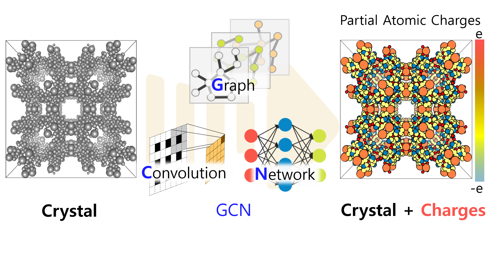

<h1 align="center">PACMAN</h1>

<h4 align="center">

</h4>              

**P**artial **A**tomic **C**harges for Porous **Ma**terials based on Graph Convolutional Neural **N**etwork (**PACMAN**)                           

[](https://python.org/downloads)[](https://pypi.org/project/GCNCharge/) [](https://doi.org/10.5281/zenodo.10822403)  [](https://github.com/sxm13/GCNCharges/LICENSE.txt) [](mailto:sxmzhaogb@gmail.com) []() []()          
                      


# Installation                             
                                 
:star: **by [pip](https://pypi.org/project/GCNCharge/)**                                                              

```sh
pip install GCNCharge
```

## by source                                                                  

**Download**                          

```sh
git clone https://github.com/sxm13/GCNCharges.git
```   
                               
```sh
pip install -r requirements.txt
```

# Charge Assignment               
You can put your cif files in any folder, but please run the code and jupyter notebook in this folder.                

**bash**
```sh
python pacman.py [folder name] [MOF/COF] [digits]
```
example: ```python pacman.py test_file MOF 10```

:star: **notebook(from pip)**                      
                
```sh      
from GCNCharge import GCNCharge
GCNCharge.predict(cif_file="Cu-BTC.cif",model_name="MOF",di=10,neutral=True)
```

file: your folder contains cif files                               
model: MOF or COF                                                   

# Website & Zenodo
*  IF you do not want to install PACMAN, you can go to this :point_right: [link](https://pacman-mtap.streamlit.app/).       
*  IF you want to DOWNLOAD full code and dataset, you can go to this :point_right: [link](https://zenodo.org/records/10822403) But we will not update new vesion in Zenodo, new vesion will upload here.            

# Reference
If you use GCN Charge, please cite [this paper]():
```bib
@article{,
    title={A Robust Partial Atomic Charge Estimator for Nanoporous Materials using Crystal Graph Convolution Network},
    DOI={},
    journal={Journal of Chemical Theory and Computation},
    author={Zhao, Guobin and Chung, Yongchul},
    year={2024},
    pages={}
}
```

# Bugs

 If you encounter any problem during using ***PACMAN***, please talk to me ```sxmzhaogb@gmail.com```.                   

 
# Development

                  
| Database with DDEC Charges                                                                                                                                      | url                                                                                                                                        | size                                                                                                                                                                                                                                                                                                                                                                                              |
| ---------------------------------------------------------------------------------------------------------------------------------------------- | -------------------------------------------------------------------------------------------------------------------------------------------------------- | --------------------------------------------------------------------------------------------------------------------------------------------------------------------------------------------------------------------------------------------------------------------------------------------------------------------------------------------------------------------------------------------------------- |
| QMOF | [link](https://github.com/Andrew-S-Rosen/QMOF) | 16,779 |
| CoRE MOF 2014 DDEC | [link](https://zenodo.org/records/3986573#.XzfKiJMzY8N) | 2,932 |
| CoRE MOF 2014 DFT-optimized | [link](https://zenodo.org/records/3986569#.XzfKcpMzY8N) | 502 | 
| CURATED-COFs | [link](https://github.com/danieleongari/CURATED-COFs) | 612 |

#### Workflow            
             
                    
### Folder explain
```
.
├─� ..
├─� figs                                                # Figures used for introduction 
�   ├─� toc.jpg                                         # Table of Contents
�   └─� workflow.png                                    # Workflow of this project
â”?
├─� model                                               # Python files used for dataset prepartion & GCN training
�   ├─� GCN_E.py                                        # Networks model for energy/bandgap training
�   ├─� GCN_ddec.py                                     # Networks model for atomic charge training
�   ├─� cif2data.py                                     # Convert QMOF database to dataset
�   ├─� data_E.py                                       # Convert cif to graph & target (energy/bandgap)
�   ├─� data_ddec.py                                    # Convert cif to graph & target (atomic charge)
�   └─� utils.py                                        # Normalizer, sampling, AverageMeter, save_checkpoint
â”?
├─� model4pre                                           # Python files used for prediction
�   ├─� GCN_E.py                                        # Networks model for energy/bandgap prediction
�   ├─� GCN_ddec.py                                     # Networks model for atomic charge prediction
�   ├─� atom_init.json                                  # 
�   ├─� cif2data.py                                     # Read/write cif file
�   ├─� data.py                                         # Convert cif to graph & target (energy/bandgap)
�   ├─� data_ddec.py                                    # Convert cif to graph & target (atomic charge)
�   └─� utils.py                                        # Normalizer, sampling, AverageMeter, save_checkpoint
â”?
├─� pth                                                 # Models of this project
�   ├─� best_bandgap                                    # Bandgap
�   �   ├─� bandgap.pth                                 # Bandgap model
�   �   └─� normalizer-bandgap.pkl                      # Normalizer of bandgap
�   ├─� best_ddec                                       # MOF DDEC
�   �   ├─� ddec.pth                                    # ///
�   �   └─� normalizer-ddec.pkl                         # ///
�   ├─� best_ddec_COF                                   # ///
�   �   ├─� ddec.pth                                    # ///
�   �   └─� normalizer-ddec.pkl                         # ///
�   ├─� best_pbe                                        # ///
�   �   ├─� pbe-atom.pth                                # ///
�   �   └─� normalizer-pbe.pkl                          # ///
�   ├─� chk_bandgap                                     # Bandgap
�   �   └─� checkpoint.pth                              # Checkpoint of bandgap
�   ├─� chk_ddec                                        # ///
�   �   └─� checkpoint.pth                              # ///
�   └─� chk_pbe                                         # ///
�       └─� checkpoint.pth                              # ///
â”?
├─� GCNCharge.ipynb                                     # notebook example for atomic charge assignment
├─� GCNCharge.py                                        # main python file for atomic charge assignment by command line
├─� GCNCharge4notebook.py                               # main python file for atomic charge assignment by notebook
├─� LICENSE.txt                                         # MIT license
├─� README.md                                           # Usage/Source
├─� predict_E.py                                        # main python file for energy/bandgap prediction
├─� predict_ddec.py                                     # main python file for atomic charge prediction
├─� requirements.txt                                    # packages need to be installed
├─� train_E.py                                          # main python file for energy/bandgap training
└─� train_ddec.py                                       # main python file for atomic charge training

```

 
**Group:**   [Molecular Thermodynamics & Advance Processes Laboratory](https://sites.google.com/view/mtap-lab/home?authuser=0)                                
